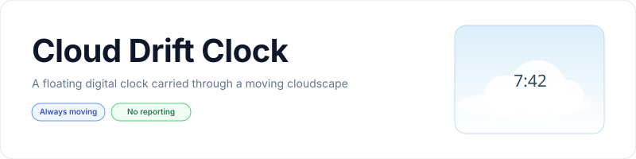
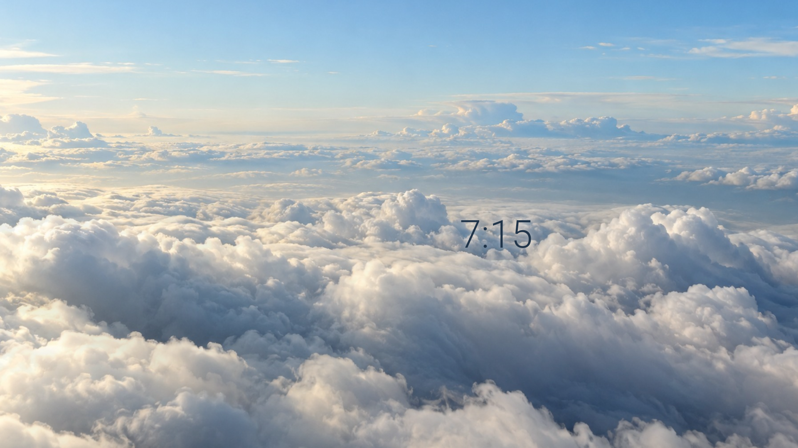

<p align="center">
  <picture>
    <source media="(prefers-color-scheme: dark)" srcset="art/banner-dark.svg">
    <source media="(prefers-color-scheme: light)" srcset="art/banner-light.svg">
    
  </picture>
</p>

<p align="center">An animated digital clock drifting through layered, moving clouds for Fire TV, Android TV, and Google TV.</p>

<p align="center">
  <a href="https://github.com/jeremykenedy/cloud-drift-clock/releases"></a>
  <a href="https://github.com/jeremykenedy/cloud-drift-clock/actions/workflows/ci.yml"></a>
  <a href="https://github.com/jeremykenedy/cloud-drift-clock/actions/workflows/style.yml"></a>
  <a href="https://github.com/jeremykenedy/cloud-drift-clock/actions/workflows/docs.yml"></a>
  <a href="https://github.com/jeremykenedy/cloud-drift-clock/actions/workflows/security.yml"></a>
  <a href="https://github.com/jeremykenedy/cloud-drift-clock/releases"></a>
  <a href="LICENSE"></a>
  <a href="https://github.com/jeremykenedy?tab=followers"></a>
  <a href="https://github.com/jeremykenedy/cloud-drift-clock/stargazers"></a>
  <a href="https://github.com/sponsors/jeremykenedy"></a>
</p>

Show some love by starring this repository on GitHub.

## Table of Contents

- [Overview](#overview)
- [Features](#features)
- [Screenshots](#screenshots)
- [Settings](#settings)
- [Requirements](#requirements)
- [Installation](#installation)
- [Fire TV Toolkit](#fire-tv-toolkit)
- [Privacy](#privacy)
- [Device support](#device-support)
- [Build and test](#build-and-test)
- [Documentation](#documentation)
- [License](#license)

## Overview

Cloud Drift Clock is an offline Android DreamService that displays the local time over an animated, photographic cloudscape. The camera drifts slowly through the cloud layers while the clock moves gently across the screen to reduce static placement.

## Features

- Photo-realistic cloud layers with continuous, slow camera and foreground drift.
- A local digital clock with selectable format, size, seconds, and movement.
- Daylight, golden-hour, and moonlit palettes, with random options for scene settings.
- D-pad-friendly settings and preview screens, plus a stable settings provider for host apps.
- No ads, analytics, tracking, reporting, or runtime network access.

## Screenshots

<table>
  <tr><th>Android TV emulator, 1920 by 1080</th></tr>
  <tr><td></td></tr>
</table>

The preview capture was taken from the running app after the scene settled on an Android TV emulator, API 31, at 1920 by 1080. The app also includes a separate settings activity and full-screen preview activity.

## Settings

The app provides D-pad accessible controls for sky palette (daylight, golden hour, moonlit, or random), cloud density, cloud speed, clock size, clock drift, 12-hour or 24-hour time, seconds (off, on, or random), and randomizing all supported settings each time the screensaver starts. Each choice setting supports Random. The clock is the only text in the screensaver scene.

See [Configuration](docs/CONFIGURATION.md) and the [settings provider schema](docs/SETTINGS_PROVIDER.md) for defaults, persistence, and host-app access.

## Requirements

The app requires Android 6.0 (API 23) or later with DreamService support. Choose it from the device's screensaver or ambient-mode settings. The computer-based installer requires Python 3 and ADB; the optional Fire TV Toolkit flow requires Node.js.

## Installation

Download the signed APK and its `.sha256` file from [GitHub Releases](https://github.com/jeremykenedy/cloud-drift-clock/releases), verify the checksum, then install:

```bash
shasum -a 256 -c cloud-drift-clock.apk.sha256
adb install -r cloud-drift-clock.apk
```

To install or update directly through ADB from this checkout:

```bash
python3 install.py --serial TV_IP:5555
```

The installer asks before making changes, verifies the release checksum, installs only this app, and leaves the TV's current screensaver selection and system timers untouched. Remove it with `python3 install.py --serial TV_IP:5555 --uninstall` and confirm at the prompt. For unattended removal, both `--yes` and `--force` are required.

After installation, use Android's screensaver settings to choose **Cloud Drift Clock**. The app's launcher entry opens its settings and animation preview.

## Fire TV Toolkit

[Fire TV Toolkit](https://github.com/jeremykenedy/fire-tv-toolkit) offers a guided terminal flow for installing and removing vetted screensavers, selecting the active saver, adjusting screensaver and sleep timers, and restoring saved device settings. Its `guard` feature can detect and restore selected supported settings if Fire OS changes them. These are Toolkit features; this app does not change system settings or prevent Amazon from changing them.

Install Toolkit on the computer used to manage the TV:

```bash
git clone https://github.com/jeremykenedy/fire-tv-toolkit.git
cd fire-tv-toolkit
node setup.js
```

Once Cloud Drift Clock has been added to Toolkit's reviewed screensaver catalogue, use:

```bash
firetv-screensavers --install=cloud-drift-clock --yes
screensaver --set=cloud-drift-clock
firetv-screensavers --install=cloud-drift-clock --yes
firetv-screensavers --uninstall=cloud-drift-clock --yes --force
```

The second install command updates the app in place and keeps its settings. Toolkit applies the same guided safeguards and checksum verification used for its other catalogue entries. Toolkit integration is separate from this repository's standalone installer. See Toolkit's [screensaver guide](https://github.com/jeremykenedy/fire-tv-toolkit/blob/main/docs/SCREENSAVERS.md) and [command reference](https://github.com/jeremykenedy/fire-tv-toolkit/blob/main/docs/COMMANDS.md).

## Privacy

Cloud Drift Clock has no ads, analytics, tracking, telemetry, crash reporting, or runtime network access. Its APK does not request Internet permission and includes no network SDK. The optional standalone installer contacts GitHub only when the user requests a release download; it sends no device settings or usage data.

## Device support

| Device | Status | Evidence |
| --- | --- | --- |
| Android TV emulator, API 31, 1920 by 1080 | Settings and full-screen animation preview exercised; provider settings queried and updated; native DreamService selection/start unavailable because this image lacks `cmd dream` | `adb` screenshot and provider queries, 2026-10-08 |
| Fire TV hardware | Untested; no device was available | [Please help test](https://github.com/jeremykenedy/cloud-drift-clock/issues/new?template=device-test.yml) and report model, Fire OS version, resolution, behavior, and results |
| Android TV hardware | Untested; no device was available | [Please help test](https://github.com/jeremykenedy/cloud-drift-clock/issues/new?template=device-test.yml) and report model, Android version, resolution, behavior, and results |
| Google TV hardware | Untested; no device was available | [Please help test](https://github.com/jeremykenedy/cloud-drift-clock/issues/new?template=device-test.yml) and report model, Android version, resolution, behavior, and results |

The app uses Android's standard DreamService API, but vendor picker availability and automatic idle activation have not been verified on physical devices. This emulator run does not establish 4K rendering or hardware performance.

## Build and test

Requirements: JDK 21, Android SDK platform 36 and build-tools 36.0.0, Python 3, and an internet connection for the pinned Gradle distribution and coverage dependencies.

```bash
./test.sh
./build.sh --unsigned
./build.sh
```

The default signed build creates a unique local signing key under `~/.android/` on first use. Keep the `.jks` file and its `.pass` file backed up and secure; future APK updates must use the same key. CI builds unsigned artifacts only.

## Documentation

- [Architecture](docs/ARCHITECTURE.md)
- [Build instructions](docs/BUILDING.md)
- [CI checks](docs/CI.md)
- [Configuration](docs/CONFIGURATION.md)
- [Installation and removal](docs/INSTALLATION.md)
- [Privacy details](docs/PRIVACY.md)
- [Settings provider](docs/SETTINGS_PROVIDER.md)
- [Testing and coverage](docs/TESTING.md)
- [Troubleshooting](docs/TROUBLESHOOTING.md)
- [Device verification](docs/VERIFICATION.md)
- [Release process](docs/RELEASING.md)
- [Release notes](docs/releases/v1.0.0.md)
- [Artwork provenance](docs/ARTWORK.md)

## License

Cloud Drift Clock is licensed under the [Apache License 2.0](LICENSE). See [NOTICE](NOTICE) for project notices.
